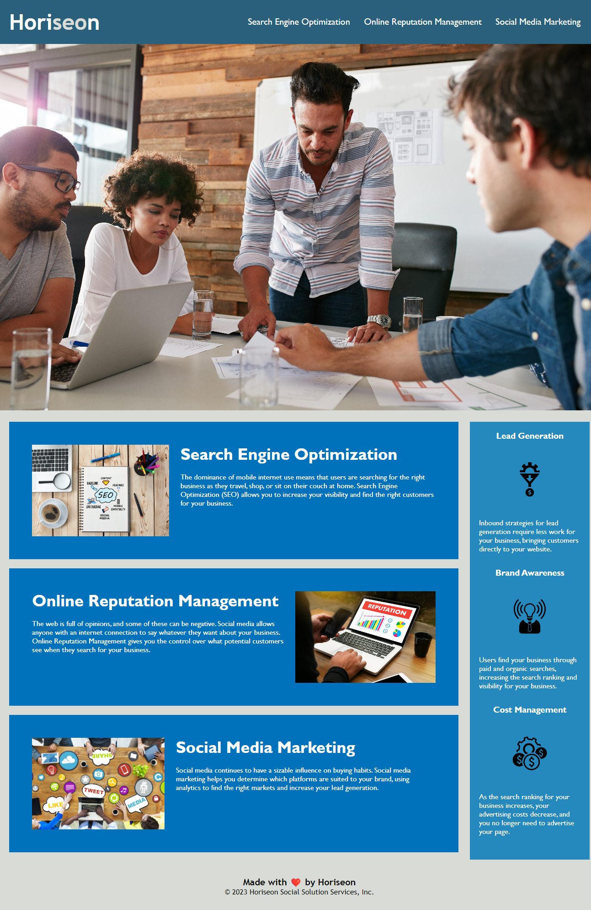

# horiseon-refactored

## Description
This project is a code refactor for the Horiseon website Homepage. Refactoring is done in order to improve the existing code without changing what it does. The refactored changes for this project were made to reflect efficiency, comprehensibility, and accesibility purposes in the code. This also results in a site that is more optimized for search engines.

## Tasks Completed

### In HTML:
- Organized elements to follow a structured logic.
- Changed the title element to a more concise and descriptive title called "Horiseon Homepage".
- Replaced elements with semantic elements.
- Fixed functionality of the navigation bar.
- Added alt text to images for accessibility.
- Added comments that explain refactored changes.
    
### In CSS:
- Reorganized CSS so that classes and elements follow a logical structure flow.
- Consolidated classes for efficiency and simplicity.
- Added comments for organization purposes and to explain refactored changes.

## Installation

N/A

## Usage
The deployed application can be viewed through a desktop web browser. However, it is not yet optimized for screen sizes with a resolution smaller than 768px.

The following image shows the up to date appearance and function of the Horiseon Homepage:

## Credits

N/A

## License

MIT License

Copyright (c) 2023 Nainoa Dinson

Permission is hereby granted, free of charge, to any person obtaining a copy
of this software and associated documentation files (the "Software"), to deal
in the Software without restriction, including without limitation the rights
to use, copy, modify, merge, publish, distribute, sublicense, and/or sell
copies of the Software, and to permit persons to whom the Software is
furnished to do so, subject to the following conditions:

The above copyright notice and this permission notice shall be included in all
copies or substantial portions of the Software.

THE SOFTWARE IS PROVIDED "AS IS", WITHOUT WARRANTY OF ANY KIND, EXPRESS OR
IMPLIED, INCLUDING BUT NOT LIMITED TO THE WARRANTIES OF MERCHANTABILITY,
FITNESS FOR A PARTICULAR PURPOSE AND NONINFRINGEMENT. IN NO EVENT SHALL THE
AUTHORS OR COPYRIGHT HOLDERS BE LIABLE FOR ANY CLAIM, DAMAGES OR OTHER
LIABILITY, WHETHER IN AN ACTION OF CONTRACT, TORT OR OTHERWISE, ARISING FROM,
OUT OF OR IN CONNECTION WITH THE SOFTWARE OR THE USE OR OTHER DEALINGS IN THE
SOFTWARE.
